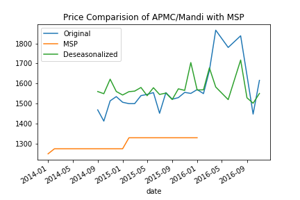

# APMC Trends
Understanding trends in APMC (Agricultural produce market committee)/mandi price & quantity arrival data for different commodities in Maharashtra.
## Objective
- Test and filter outliers.
- Understand price fluctuations accounting the seasonal effect
- Detect seasonality type (multiplicative or additive) for each cluster of APMC and commodities
- De-seasonalise prices for each commodity and APMC according to the detected seasonality type
- Compare prices in APMC/Mandi with MSP(Minimum Support Price)- raw and deseasonalized
## Getting Started
All the trends analysis is done using jupyter notebook and python libraries.

### Installation

#### Jupyter lab
The easiest way to install Jupyter Notebook and other Ml libraries is using [Conda](https://conda.io/docs/), which is the package manager that the [Anaconda](http://docs.continuum.io/anaconda/) distribution is built upon.
Check your conda version after completing the installation.
```
$ conda -V
```
I am using 4.5.11 on my Linux machine.

**Create a virtual environment for your project**

Check conda is up to date
```
$ conda update conda
```
Create and activate your virtual environment
```
$ conda create -n yourenvname python=3.6 anaconda
$ source activate yourenvname
```
If python3.6 is not installed on your system you can install [python 3.6](https://www.python.org/downloads/) from here.

### From the source code
After activating your conda environment, clone this git repo using:
```
$ git clone https://github.com/Manasjain/APMC_Trends.git
```
Start Jupyter labs
```
$ jupyter lab
```
## APPROACH
### DATA PREPROCESSING
The Initial data preprocessing is done by removing all non-alphanumeric characters then converting all string objects to lower alphabets, just to have a generalized data. This yields a common dataset with all relevant variables, including prices, dates, MSP, and crop season.


### REMOVING OUTLINERS
Outliers are treated using the standard statistical procedure, wherein all values not within the 25th to 75th percentile in the interquartile ranges are removed. Although different percentile range can be chosen. This is done after the data has been grouped by commodity, so as to be sensitive to the price of different commodities. For example, the normal price of commodity A may be much higher than that of commodity B, so the outlier detection must be performed as per individual commodity price range. 

Showing below two figures of the modal price of 'wheathusked' with and without outliers.


### TIME SERIES & TESTING STATIONARITY
**Statistical stationarity**: A stationary time series is one whose statistical properties such as mean, variance, autocorrelation, etc. are all constant over time.

**Why testing stationarity?**
- Any non-stationary processes can be decompose into **trend**, **seasonality** and **residual**. So, before finding seasonality type we ensure that our time series has some seasonal composition in it.
- A stationary process can further be modeled into any standard statistical model to predict future values.

For testing stationarity, I have considered three methods
        - rolling mean
        - rolling standard deviation
        - Dickey-Fuller test


Time series and stationarity test are done with the help of an illustrative example:

Suppose we consider only those APMC/commodity combinations with enough data to constitute a time series from which we can identify seasonality trends. To illustrate I have used the time series of bajri prices in sangamner APMC.


Eyeballing the plot we cannot comment much on trend and seasonality but by Dickey-Fuller test our ADF Statistic value is less than 10% critical value, which means we are assured of that our series is 90% stationary. On further analyzing we p-value of the test is also more than 0.05, thus this indicates that there is some non-stationarity present in it.

### MAKING THE TIME SERIES STATIONARY
- Reducing trend using moving average:

We can reduce the trend in a time series by taking a log of it then subtract the rolling mean of the series. This gives much better results on the Dickey-Fuller test.

- Reducing Seasonality along with Trend using Decomposing :
Model both trend and seasonality, then remove them from the time series.
    - Additive model: In an additive time series, the components add together to make the time series. If you have an increasing trend, you still see roughly the same size peaks and troughs throughout the time series.
    - Multiplicative model: In a multiplicative time series, the components multiply together to make the time series.If you have an increasing trend, the amplitude of seasonal activity increases. Everything becomes more exaggerated.


Below are the results of an additive model of seasonal decomposition


Remove the trend and seasonality from the Time series and now we can use the residual values. On checking stationarity, we get ADF Statistic: -6.767319 which is less than 1% critical value.


This is stationary because:
- the test statistic is lower than 1% critical values.
- the mean and std variations have small variations with time.

### FORECASTING A TIME SERIES
Now that we have made the Time series stationarity, let’s make models on the time series using differencing because it is easy to add the error, trend, and seasonality back into predicted values.

I am using statistical modeling method called ARMA to forecast the data where there are dependencies in the values. Before fitting a modal we need to find the optimal parameters which result in the best fit model.  

```
import warnings
warnings.filterwarnings("ignore")
from statsmodels.tsa.arima_model import ARMA
aiclist = []
paramList = []
for p in range(1,3):
    for d in range(2):
        for q in range(3):
            try:
                arima_mod=ARMA(timeseries,(p,d,q)).fit(transparams=True)
                x=arima_mod.aic
                x1= p,d,q
                aiclist.append(x)
                paramList.append(x1)
                aic.append(x)
                pdq.append(x1)
            except:
                pass
            
param = paramList[aiclist.index(min(aiclist))]
```

After finding optimal parameters we will obtain modal fitted values according to those parameters.

Finally, for our third objective, we will load MSP data from the CSV, group them by commodity, resample them by each month and plot it with our modal fit values and our original time series.




### POINTS TO NOTE:
- It is possible to reduce computation by checking only those clusters that return a positive ADF test for non-stationarity.
- Other statistical models can be used for better results.
